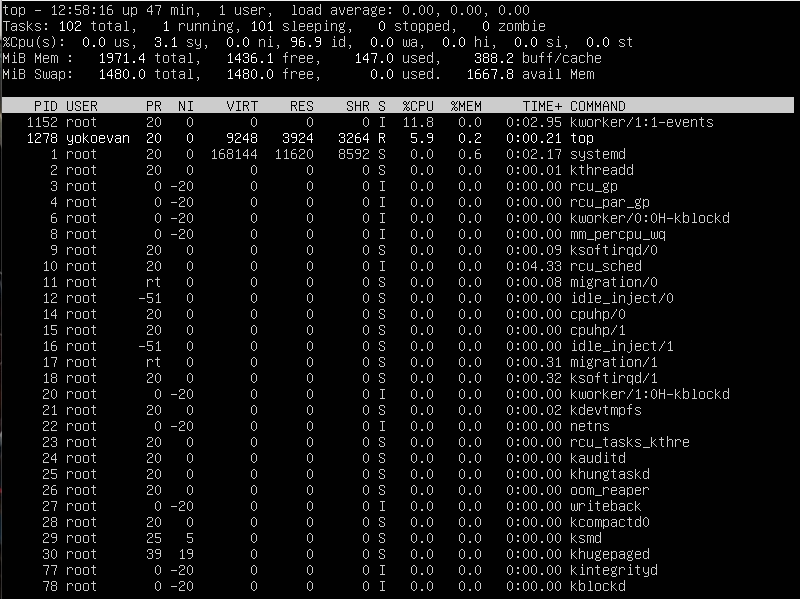
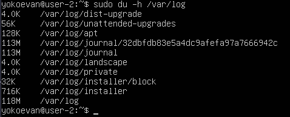

# Linux

## Part 1. Installation of the OS

* Checking Ubuntu version by using the command ```cat /etc/issue```:\


## Part 2. Creating a user

* The command call to creat user (and to add them to adm group):\


* The output of the command ```cat /etc/passwd``` (to see a list of the system’s accounts):\


## Part 3. Setting up the OS network

* To set the machine name as user-1 I used the next command ```hostnamectl set-hostname user-1```:\


* To set the time zone corresponding to my current location I used some commands (copied the previous symbolic link, and then created a new one from the Moscow time zone file):\


* To output the names of the network interfaces I used ```ip``` command. lo (loopback device) is a special virtual network interface that a computer uses to communicate with itself; it is used mainly for diagnostics and troubleshooting, and to connect to servers running on the local machine:\


* To get the ip address of the device I was working on from the DHCP server I used the command ```sudo dhclient -v```. Dynamic Host Configuration Protocol - is a network protocol used to automate the process of configuring devices on IP networks; A DHCP server dynamically assigns an IP address and other network configuration parameters to each device on a network so they can communicate with other IP networks:\


* To define the internal IP address of the gateway (default ip address - gw) and the external ip address of the gateway (ip) I used the commands ```ip r``` and ```curl ifconfig.me``` respectively:\


* To set static ip, gw and dns settings I made configuration changes using the next commands ```sudo vim /etc/netplan/00-installer-config.yaml``` and ```sudo netplan apply```. The changes in the configuration file for Netplan were:\


* To reboot the virtual machine I used the command ```reboot```. The changes in previous step correspond to current network settings:\


* To ping 1.1.1.1 and ya.ru remote hosts I used the next command ```ping -c 10 destination``` (the option -c needs to stop after sending 10 packets). The output of the command was successful:\


## Part 4. OS Update

* The commands ```sudo apt update``` and ```sudo apt upgrade``` were used to update the system packages to the latest version. After entering the update command again the output message was:\


## Part 5. Using the sudo command

* The ```sudo``` command allows users to run programs with the security privileges of another user (by default, as the superuser). It prompts users for their personal passwords and confirms their request to execute a command by checking a file, called sudoers, which the system administrator configures. Using the sudoers file, system administrators can give certain users or groups access to some or all commands without those users having to know the root password.

* I allowed user created in Part 2 (*new-user*) to execute sudo command by using the command ```sudo usermod -aG sudo new-user```, then I used ```su new-user``` to switch user and ```sudo hostnamectl set-hostname user-2``` to change the OS hostname via the *new-user*. Screenshot with changed hostname is below (to return to the original user the command ```exit``` is needed):\


## Part 6. Installing and configuring the time service

* The time of the time zone in which I am currently located:\


* The output of the following command ```timedatectl show```:\


## Part 7. Installing and using text editors

* The content of the file *test_vim.txt* before closing (to exit with the saved changes it's needed to press ```ESC``` to switch to Command Mode and type the next command ```:wq```):\


* The content of the file *test_nano.txt* before closing (to exit with the saved changes it's needed to press ```CTRL+O``` to write changes to a file (it will prompt for file name, just press ```ENTER```), then press ```CTRL+X``` to quit nano):\


* The content of the file *test_joe.txt* before closing (to exit with the saved changes it's needed to press ```CTRL+K X```):\


* The content of the file *test_vim.txt* after editing (to exit without the saved changes it's needed to press ```ESC``` to switch to Command Mode and type the next command ```:q!```):\


* The content of the file *test_nano.txt* after editing (to exit without the saved changes it's needed to press ```CTRL+X``` (it will prompt if there are unsaved changes, just press ```N```)):\


* The content of the file *test_joe.txt* after editing (to exit without the saved changes it's needed to press ```CTRL+C``` (it will ask about loosing changes to this file, just press ```Y```)):\


* To search any word in the file *test_vim.txt* using **vim** it's needed to press ```ESC``` to switch to Command Mode and type the next command ```/pattern```:\


* To replace any word with another one in the file *test_vim.txt* using **vim** it's needed to press ```ESC``` to switch to Command Mode and type the next command ```:g/pattern1/s//pattern2/g```:\


* To search any word in the file *test_nano.txt* using **nano** it's needed to press ```CTRL+W```:
    * it will ask to type a searching string and press ```ENTER```:\
    
    * then the cursor will jump to the first occurrence of that match:\
    

* To replace any word with another one in the file *test_nano.txt* using **nano** it's needed to press ```ALT+R```:
    * it will ask to type a string to be replaced and press ```ENTER```:\
    
    * then it will ask to type a replacing string and press ```ENTER```:\
    
    * finally it will request confirmation to replace the highlighted instance (just press ```Y```):\
    

* To search or to replace any word in the file *test_joe.txt* using **joe** it's needed to press ```CTRL+K F```:
    * it will ask to type a searching string and press ```ENTER```:\
    
    * then it will ask to choose option and we need to choose ```R```:\
    
    * afterwards it will request for the replacing word and we need to type it:\
    
    * finally it will request confirmation to replace the highlighted instance which it found (we press ```Y``` or ```N```, depending on what we want (to replace or to search)):\
    

## Part 8. Installing and basic setup of the SSHD service

* To install the SSHd service I used the next command ```sudo apt install openssh-server```.

* To add an auto-start of the service whenever the system boots I used the command ```sudo systemctl enable ssh```.

* To reset the SSHd service to port 2022 I made configuration changes using the next commands ```sudo cp /etc/ssh/sshd_config /etc/ssh/sshd_config.factory-defaults```, ```sudo vim /etc/ssh/sshd_config``` and ```sudo systemctl restart ssh```. The changes in the configuration file were:\


* To show the presence of the sshd process using the ```ps``` command I used the next keys (```ps``` displays information about a selection of the active processes; ```f``` - displays the hierarchy of processes in a visual ASCII art format, illustrating parent-child relationships; ```C``` - selects the processes whose executable name is given in cmdlist):\


* To reboot the system I used the next command ```reboot```.

* The output of the ```netstat -tan``` command (```netstat``` is a command line utility for Linux that prints network connections, routing tables, interface statistics, masquerade connections, and multicast memberships):\


* What the output and the keys of ```netstat -tan``` mean:
    * Keys: ```n``` shows numerical addresses instead of trying to determine symbolic host, port or user names; ```t``` displays TCP connections only; ```a``` shows both listening and non-listening (for TCP this means established connections) sockets.
    * Output columns:
        * Proto - the protocol (tcp, udp, raw) used by the socket.
        * Recv-Q - the count of bytes not copied by the user program connected to this socket.
        * Send-Q - the count of bytes not acknowledged by the remote host.
        * Local Address - address and port number of the local end of the socket. Unless the --numeric (-n) option is specified, the socket address is resolved to its canonical host name (FQDN), and the port number is translated into the corresponding service name.
        * Foreign Address - address and port number of the remote end of the socket. Analogous to Local Address.
        * State - the state of the socket. Since there are no states in raw mode and usually no states used in UDP, this column may be left blank. In the output there are such values as LISTEN (the socket is listening for incoming connections) and TIME_WAIT (the socket is waiting after close to handle packets still in the network).
    * 0.0.0.0 address allows the computer and servers to temporarily communicate on the network before they receive a valid IP address from a DHCP server. The IP address 0.0.0.0 often serves as the source address in a packet that a machine sends to request its current IP address as a “null” or “unspecified” address. In the ```netstat``` command output 0.0.0.0 (the source, or local address) means that it is open to all interfaces on the machine, regardless of their IP address.

## Part 9. Installing and using the top, htop utilities

* The example of the ```top``` command output:\


* From the output of the top command I determined the next parameters:
    * *uptime*: 13:09:38 up 58 min (system has been running for 58 minutes since the last boot);
    * *number of authorized users*: 1;
    * *total system load*: 0.00, 0.00, 0.00 (the three numbers show the load averages on a CPU for the last minute, 5 minutes, and 15 minutes respectively);
    * *total number of processes*: 102;
    * *cpu load*:
        * *us*: 0.0 (the percent of time spent running user processes);
        * *sy*: 0.2 (the percent of time spent running the kernel);
        * *ni*: 0.0 (the percent of time spent running processes with manually configured nice values);
        * *id*: 99.8 (the percent of time idle (if high, CPU may be overworked));
        * *wa*: 0.0 (the percent of wait time (if high, CPU is waiting for I/O access));
        * *hi*: 0.0 (the percent of time managing hardware interrupts);
        * *si*: 0.0 (the percent of time managing software interrupts);
        * *st*: 0.0 (the percent of virtual CPU time waiting for access to physical CPU);
    * *memory load*:
        * *MiB Mem* (displays physical memory utilization):
            * *total*: 1971.4 (shows total installed memory);
            * *free*: 1435.8 (shows available memory);
            * *used*: 147.3 (shows consumed memory);
            * *buff/cache*: 388.3 (shows the amount of information buffered to be written);
        * *MiB Swap* (reflects mostly virtual memory):
            * *total*: 1480.0 (shows total swap space);
            * *free*: 1480.0 (shows available swap space);
            * *used*: 0.0 (shows consumed swap space);
            * *avail Mem*: 1667.6 (shows the amount of information cached for future reads);
    * *pid of the process with the highest memory usage*: 676 (COMMAND - snapd) (to sort it's needed to press ```SHIFT+M```);
    * *pid of the process taking the most CPU time*: 1152 (COMMAND - kworker/1:1-events) (to sort it's needed to press ```SHIFT+P```).

* The ```htop``` command output:
    * Sorted by the following parameters (to sort it's needed to press ```F6```):
        * PID:\
        
        * PERCENT_CPU:\
        
        * PERCENT_MEM:\
        
        * TIME:\
        
    * Filtered for sshd process (to filer it's needed to press ```F4```):\
    
    * The syslog process found by searching (to search it's needed to press ```F3```):\
    
    * With hostname, clock and uptime output added (to add extra information it's needed to press ```F2```):\
    

## Part 10. Using the fdisk utility

* The output of the ```fdisk -l``` command:\


* Information from the output:
    * *Name of the hard disk*: /dev/sda;
    * *Capacity*: 10 GiB;
    * *Number of sectors*: 20971520.

* There is no information about *the swap size*, so I used the next command ```swapon --show``` to get it (it is 1.5 G):\


## Part 11. Using the df utility

* The output of the ```df``` command:\


* Information from the output for the root partition (/):
    * *Partition size*: 8408452; 
    * *Space used*: 4746432;
    * *Space free*: 3213304;
    * *Percentage used*: 60%;
    * *The measurement unit*: K (kilobyte).

* The output of the ```df -Th``` command:\


* Information from the output for the root partition (/):
    * *Partition size*: 8.1G; 
    * *Space used*: 4.6G;
    * *Space free*: 3.1G;
    * *Percentage used*: 60%;
    * *The file system type*: ext4.

## Part 12. Using the du utility

* The output of the ```du``` command:\


* The output of the folders' size:
    * in bytes (it's needed to use the ```du /path``` command):
        * /home:\
        
        * /var:\
        
        * /var/log:\
        
    * in human readable format (it's needed to use the ```du -h /path``` command):
        * /home:\
        
        * /var:\
        
        * /var/log:\
        

* The output of the size of all contents in /var/log (it's needed to use the ```sudo du -a /var/log/*``` command, but because of a big amount of content we can't see all output, so we can write the output to a file - ```sudo du -a /var/log/* >> content.txt```):\


## Part 13. Installing and using the ncdu utility

* The output of the folders' size:
    * /home (the ```ncdu /``` command was used):\
    
    * /var (the ```ncdu /``` command was used):\
    
    * /var/log (the ```ncdu /var``` command was used):\
    

## Part 14. Working with system logs

* To get information about the last login session I searched in */var/log/auth.log*:\

    * *The last successful login time*: Feb 10 11:52:25;
    * *User name*: yokoevan;
    * *Login method*: LOGIN.

* The screenshot of the SSHd service restart message:
    * from */var/log/syslog*:\
    
    * from */var/log/auth.log*:\
    

## Part 15. Using the CRON job scheduler

* Lines in the system logs about the execution:\


* A list of current jobs for CRON (to see them it's needed to use the ```crontab -l``` command, to edit them - ```crontab -e```):\


* The list of current tasks for CRON after removing all tasks (to remove all tasks it's needed to use the ```crontab -r``` command):\
