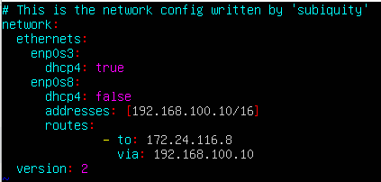
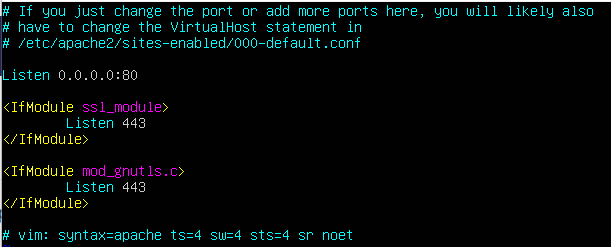
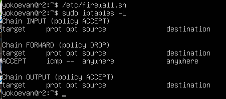
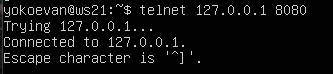

# Linux Network

## Part 1. ipcalc tool

#### 1.1. Networks and Masks

1. To define network address it needs to use the next command:\

    * *Network address of 192.167.38.54/13*: 192.160.0.0

2. Conversion of the masks 255.255.255.0, /15, and 11111111.11111111.11111111.11110000:
    | Normal | Prefix | Binary |
    | :------: | :------: | :------: |
    | ***255.255.255.0*** | /24 | 11111111.11111111.11111111.00000000 |
    | 255.254.0.0 | ***/15*** | 11111111.11111110.00000000.00000000 |
    | 255.255.255.240 | /28 | ***11111111.11111111.11111111.11110000*** |

3. Minimum and maximum host in 12.167.38.4 network with masks /8, 11111111.11111111.00000000.00000000, 255.255.254.0 and /4:
    | Mask | Min Host | Max Host |
    | :------: | :------: | :------: |
    | ***/8*** | 12.0.0.1 | 12.255.255.254 |
    | ***11111111.11111111.00000000.00000000*** (/16) | 12.167.0.1 | 12.167.255.254 |
    | ***255.255.254.0*** (/23) | 12.167.38.1 | 12.167.39.254 |
    | ***/4*** | 0.0.0.1 | 15.255.255.254 |

#### 1.2. localhost

* **localhost** is a hostname that refers to the current computer used to access it. The name localhost is reserved for loopback purposes. It is used to access the network services that are running on the host via the loopback network interface. IPv4 network standards reserve the entire address block 127.0.0.0/8 (more than 16 million addresses) for loopback purposes. So an application running on localhost:
    * can be accessed with the following IPs: 127.0.0.2, 127.1.0.1;
    * can't be accessed with the following IPs: 194.34.23.100, 128.0.0.1.

#### 1.3. Network ranges and segments

1. Public and private IPs:
    * 10.0.0.45 - private;
    * 134.43.0.2 - public;
    * 192.168.4.2 - private;
    * 172.20.250.4 - private;
    * 172.0.2.1 - public;
    * 192.172.0.1 - public;
    * 172.68.0.2 - public;
    * 172.16.255.255 - private;
    * 10.10.10.10 - private;
    * 192.169.168.1 - public.

2. Gateway IP addresses for 10.10.0.0/18 network are:
    * possible: 10.10.0.2, 10.10.10.10, 10.10.1.255;
    * not possible: 10.0.0.1, 10.10.100.1.

## Part 2. Static routing between two machines

* Existing network interfaces for *ws1* and *ws2* machines (to view them it needs to use the ```ip a``` command):\


* The network interface corresponding to the internal network on both machines is **enp0s8** (en - ethernet, p0 - bus number (0), s8 - slot number (10)):
    * The interface flags are: *BROADCAST* (the device has the facility to send packets to all hosts sharing the same link) and *MULTICAST* (is an advisory flag indicating that the interface is aware of multicasting i.e. sending packets to some subset of neighbouring nodes).
    * *mtu* (Maximum Transmission Unit) is needed to determine the maximum size of each packet in any transmission (1500-byte packet is the largest allowed).
    * *qdisc* (queuing discipline) shows the queuing algorithm used on the interface (*noop* means that the interface is in blackhole mode i.e. all packets sent to it are immediately discarded).
    * *state DOWN* means that interface isn't active.
    * *group* means that interface was tagged with a group value. The role of this group value is to group interfaces together for some special operations by assigning them the same value (the default group probably won't allow some of these operations).
    * *qlen* is the default transmit queue length of the device measured in packets.
    * The second line contains information on the link layer addresses associated with the device. The first word (*ether*) defines the interface hardware type. Then there are MAC address and broadcast address.

* The changed etc/netplan/00-installer-config.yaml file for each machine:
    * *ws1*:\
    
    * *ws2*:\
    

* After I made configuration changes I ran the ```sudo netplan apply``` command to restart the network service:\


#### 2.1. Adding a static route manually

* Adding a static route from one machine to another and back using a ```ip r add``` command:\


* The call and output of the ```ping``` commands:\


#### 2.2. Adding a static route with saving

* Adding static route from one machine to another using *etc/netplan/00-installer-config.yaml* file:
    * *ws1*:\
    
    * *ws2*:\
    

* The call and output of the ```ping``` commands:\


## Part 3. iperf3 utility

#### 3.1. Connection speed

* 8 Mbps = 1 MB/s,
* 100 MB/s = 800000 Kbps, 
* 1 Gbps = 1000 Mbps

#### 3.2. iperf3 utility

* iperf3 utility was used to measure connection speed between ws1 and ws2 (iperf3 runs on port 5201 by default, hence it is necessary for this port to be unblocked, so before running iperf3 I used the ```sudo ufw allow 5201``` command):
    * *ws1* was a server and *ws2* was a client:
        * *ws1*:\
        
        * *ws2*:\
        
    * *ws2* was a server and *ws1* was a client:
        * *ws2*:\
        
        * *ws1*:\
        

## Part 4. Network firewall

#### 4.1. iptables utility

* Created /etc/firewall.sh files simulating the firewall on machines:
    * *ws1*:\
    
    * *ws2*:\
    

* Running the files on both machines:
    * *ws1*:\
    
    * *ws2*:\
    

* The difference between the strategies used in the first and second files: on ws1 machine a deny rule is at the beginning and an allow rule is at the end; on ws2 machine these rules are in reverse. Rules are executed from top to bottom, it means that the first written rule can't be overwritten by the second one. As a result, *ws1* machine can't be pinged, but *ws2* machine can.

#### 4.2. nmap utility

* Using ```ping``` command a machine which is not pinged was found, then using ```nmap``` utility the fact that the machine host is up was showed:
    * *ws1*:\
    
    * *ws2*:\
    

## Part 5. Static network routing

* Network:\


#### 5.1. Configuration of machine addresses

* The machine configurations in *etc/netplan/00-installer-config.yaml* files:
    * *r1*:\
    
    * *r2*:\
    
    * *ws11*:\
    
    * *ws22*:\
    
    * *ws21*:\
    

* Restarting the network service, checking that the machine address is correct with the ```ip -4 a``` command, pinging ws22 from ws21 and r1 from ws11:
    * *r1*:\
    
    * *r2*:\
    
    * *ws11*:\
    
    * *ws22*:\
    
    * *ws21*:\
    

#### 5.2. Enabling IP forwarding

* Running the ```sysctl -w net.ipv4.ip_forward=1``` command to enable IP forwarding (the forwarding will not work after the system is rebooted):\


* Changing */etc/sysctl.conf* file to enable IP forwarding permanently:
    * *r1*:\
    
    * *r2*:\
    

#### 5.3. Default route configuration

* Configuring the default route (gateway) for the workstations:\


* Showing that a route was added to the routing table using the ```ip r``` command:\


* Pinging r2 router from ws11:\


* Showing on r2 that the ping is reaching using the ```tcpdump -tn -i enp0s8``` command:\


* Extra - the configuration files for the routers:\


#### 5.4. Adding static routes

* Adding static routes to r1 and r2 in configuration file:\


* Showing route tables on both routers:\


* Running ```ip r list 10.10.0.0/[netmask]``` and ```ip r list 0.0.0.0/0``` commands on ws11:\


* A different route other than 0.0.0.0/0 was selected for 10.10.0.0/[netmask] because of longest prefix match routing rule. *Longest prefix match routing* is an algorithm where the router prefers the longest prefix in the routing table. When a router receives the IP packet, it compares the destination IP address bit-by-bit with prefixes in the routing table. The prefix with the most matching bits is the prefix that the router will use. So the default route wasn't selected because there was the alternative route.

#### 5.5. Making a router list

* Running the ```tcpdump -tnv -i enp0s8``` dump command on r1:\


* Using ```traceroute``` utility to list routers in the path from ws11 to ws21:\


* The first line of the ```traceroute``` output gives us the following info: the destination and its IP address, the number of hops traceroute will try before giving up and the size of the UDP packets we're sending. All of the other lines contain information about one of the hops. Hops 1 and 2 tell us that these devices didn't respond (perhaps they were configured never to send ICMP packets; or, perhaps they did respond but were too slow, so traceroute timed out). Hop 3 tells us that we reached our destination. Hops are TTL value (time to live). ```traceroute``` command sends three packets to the hop and each of the time refers to the time taken by the packet to reach the hop.

#### 5.6. Using ICMP protocol in routing

* Running on r1 network traffic capture going through enp0s8 with the ```tcpdump -n -i enp0s8 icmp``` command:\


* Pinging a non-existent IP (e.g. 10.30.0.111) from ws11 with the ```ping -c 1 10.30.0.111``` command:\


## Part 6. Dynamic IP configuration using DHCP

* Specifying the default router address, DNS-server and internal network address in the */etc/dhcp/dhcpd.conf* file for r2:\


* Writting ```nameserver 8.8.8.8``` in a *resolv.conf* file for r2:\


* Restarting the DHCP service with ```systemctl restart isc-dhcp-server```:\


* Rebooting the ws21 machine with ```reboot``` and showing with ```ip a``` that it has got an address:\


* Pinging ws22 from ws21:\


* Extra - the netplan configuration file for ws21:\


* Specifying MAC address at ws11 by adding to *etc/netplan/00-installer-config.yaml* ```macaddress: 10:10:10:10:10:BA```, ```dhcp4: true```:\


* Сonfiguring r1 the same way as r2 (but the assignment of addresses strictly linked to the MAC-address (ws11)) and running the same tests:
    * Settings of the */etc/dhcp/dhcpd.conf* file:\
    
    * Settings of the *resolv.conf* file:\
    
    * Restarting the DHCP service:\
    
    * Rebooting the ws11 machine with ```reboot``` and showing with ```ip a``` that it has got an address:\
    
    * Pinging ws22 from ws11:\
    

* Requesting ip address update from ws21:
    * before:\
    
    * after:\
    
    * to request update I used the next commands:\
    
    * used DHCP server options: option routers - default GW for clients; option domain-name-servers - DNS server IP address.

## Part 7. NAT

* Changing the line ```Listen 80``` to ```Listen 0.0.0.0:80``` in */etc/apache2/ports.conf* file (i.e. making the Apache2 server public):
    * ws22:\
    
    * r1:\
    

* Starting the Apache web server with ```service apache2 start``` command:
    * ws22:\
    
    * r1:\
    

* Adding the rules to the firewall, created similarly to the firewall from *Part 4*, on r2:\


* Running the file as in *Part 4*:\


* Checking the connection between ws22 and r1 with the ```ping``` command (ws22 should not ping from r1):\


* Adding another rule to the firewall file:\


* Running the file:\


* Checking the connection between ws22 and r1 with the ```ping``` command (ws22 should ping from r1):\


* Adding two more rules to the firewall file (enabling SNAT (which is masquerade all local ip from the local network behind r2, network 10.20.0.0) and DNAT (on port 8080 of r2 machine and add external network access to the Apache web server running on ws22)):\


* Running the file:\


* Checking the TCP connection for SNAT by connecting from ws22 to the Apache server on r1 with the ```telnet [address] [port]``` command:\


* Checking the TCP connection for DNAT by connecting from r1 to the Apache server on ws22 with the ```telnet``` command (address r2 and port 8080):\


## Part 8. Bonus. Introduction to SSH Tunnels

* Running a firewall on r2 with the rules from *Part 7*:\


* Starting the Apapche web server on ws22 on localhost only:
    * Changing the line ```Listen 80``` to ```Listen localhost:80``` in */etc/apache2/ports.conf* file:\
    
    * Starting the Apapche web server:\
    

* Using Local TCP forwarding from ws21 to ws22 to access the web server on ws22 from ws21 (```ssh -L [local_port]:[destination_address]:[destination_port] [username]@[ssh_server]``` command):\


* Running the ```telnet 127.0.0.1 [local port]``` command to check if the connection worked (it needs to press ```Alt + F2``` to go to a second terminal):\


* Using Remote TCP forwarding from ws11 to ws22 to access the web server on ws22 from ws11 (```ssh -R [remote_port]:[destination_address]:[local_port] [username]@[ssh_server]``` command):\


* Running the ```telnet 127.0.0.1 [local port]``` command to check if the connection worked (it needs to press ```Alt + F2``` to go to a second terminal):\
