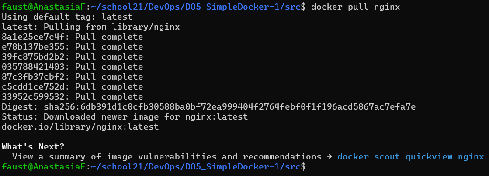
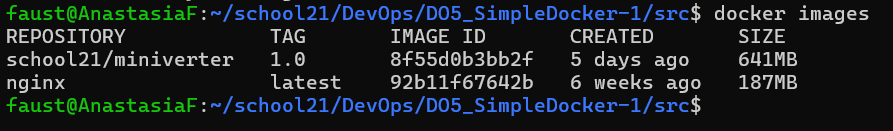

# Simple Docker

## Part 1. Ready-made docker

* Taking the official docker image from nginx and downloading it using ```docker pull```:\


* Checking for the docker image with ```docker images```:\


* Running docker image with ```docker run -d [image_id|repository]```:\


* Checking that the image is running with ```docker ps```:\


* Viewing container information with ```docker inspect [container_id|container_name]```:\

    * the container size:\
    
    * the list of mapped ports:\
    
    * the container ip:\
    

* Stopping docker image with ```docker stop [container_id|container_name]```:\


* Checking that the image has stopped with ```docker ps```:\


* Running docker with ports 80 and 443 in container, mapped to the same ports on the local machine, with ```run``` command:\


* Checking that the nginx start page is available in the browser at *localhost:80*:\


* Restarting docker container with ```docker restart [container_id|container_name]```:\


* Checking in any way that the container is running:\


## Part 2. Operations with container

* Reading the *nginx.conf* configuration file inside the docker container with the ```exec``` command:\


* Creating a *nginx.conf* file on a local machine and configuring it on the */status* path to return the nginx server status page:\


* Copying the created *nginx.conf* file inside the docker image using the ```docker cp``` command:\


* Restarting nginx inside the docker image with ```exec```:\


* Checking that *localhost:80/status* returns the nginx server status page:\


* Exporting the container to a *container.tar* file with the ```export``` command:\


* Stopping the container:\


* Delete the image with ```docker rmi [image_id|repository]``` without removing the container first:\


* Deleting stopped container:\


* Import the container back using the ```import``` command:\


* Running the imported container:\


* Checking that *localhost:80/status* returns the nginx server status page:\


## Part 3. Mini web server

* Installing the services and the libraries:
```bash
sudo apt install libfcgi-dev
sudo apt install spawn-fcgi
sudo apt install nginx
```

* To change the nginx.conf file:
```bash
sudo cp ./nginx/nginx.conf /etc/nginx/
sudo service nginx restart
```

* The commands for running:
```bash
gcc -Wall -Werror -Wextra ./server/app.c -lfcgi -o server.fcgi
spawn-fcgi -p 8080 -n server.fcgi
```

## Part 4. Your own docker

* The commands to run the server using docker:
```bash
docker build -f Dockerfile.4 . -t my-server
docker run -d -p 80:81 my-server
```

## Part 5. Dockle

* To install [dockle](https://github.com/goodwithtech/dockle) I used the next commands:
```bash
VERSION=$(
 curl --silent "https://api.github.com/repos/goodwithtech/dockle/releases/latest" | \
 grep '"tag_name":' | \
 sed -E 's/.*"v([^"]+)".*/\1/' \
) && curl -L -o dockle.deb https://github.com/goodwithtech/dockle/releases/download/v${VERSION}/dockle_${VERSION}_Linux-64bit.deb
sudo dpkg -i dockle.deb && rm dockle.deb
```

* To check docker container using *dockle*:
```bash
docker build -f Dockerfile.5 . -t my-server:5
dockle -ak NGINX_GPGKEY -ak NGINX_GPGKEY_PATH my-server:5
```

* Running the server to check that it works:
```bash
docker run -d -p 80:81 my-server:5
```

## Part 6. Basic Docker Compose

* Building and running the project:
```bash
docker-compose build
docker-compose up
```